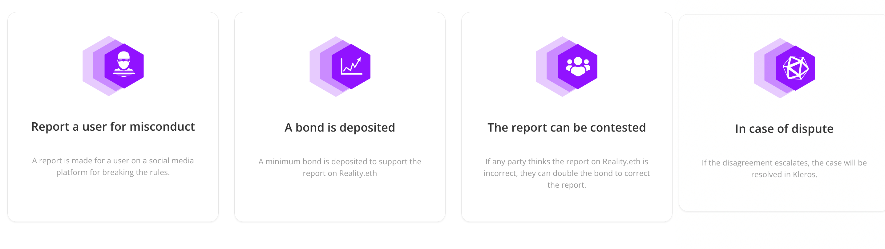

# Moderate

⚖️[ Susie the Telegram Kleros Moderator Bot](https://t.me/SusieTheKlerosModeratorBot?startgroup=botstart) ⚖️

**Kleros Moderate** is a family of content moderation bots which use Reality.Eth with Kleros as an [oracle.md](../oracle.md "mention") for moderation decisions (did the user break the rules?).&#x20;

<figure><figcaption>
Community management is hard, but Kleros Moderate can help
</figcaption></figure>

Supports

* [Telegram](https://t.me/SusieTheKlerosModeratorBot?startgroup=botstart) 
* Discord (soon)

How does it work?

<figure><figcaption>
Crowd-sourcing moderation with Reality.eth &#x26; Kleros
</figcaption></figure>
